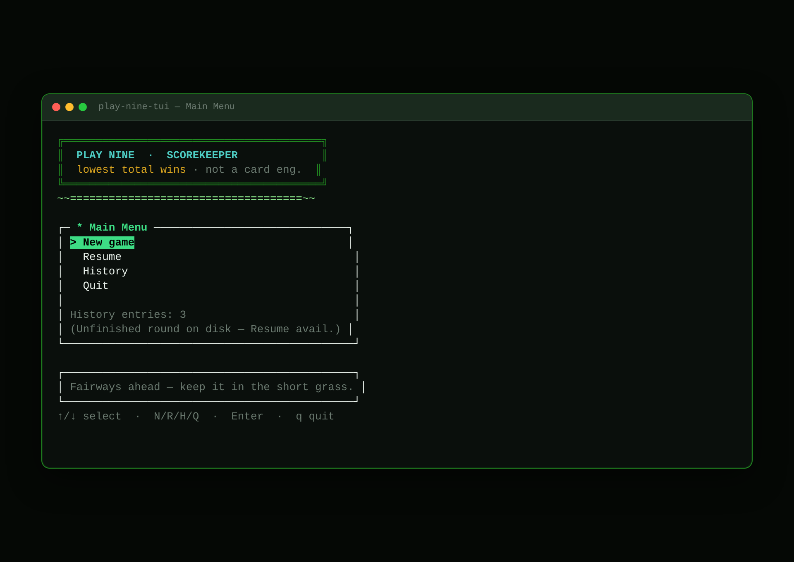
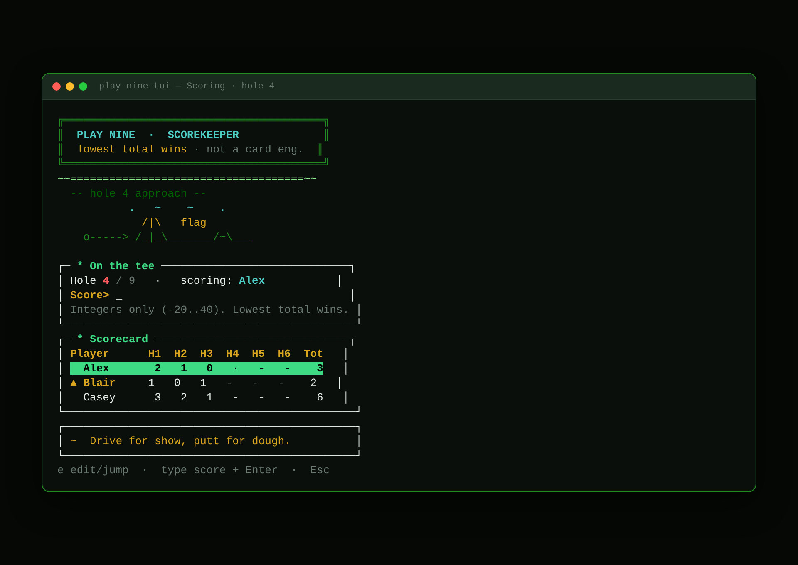
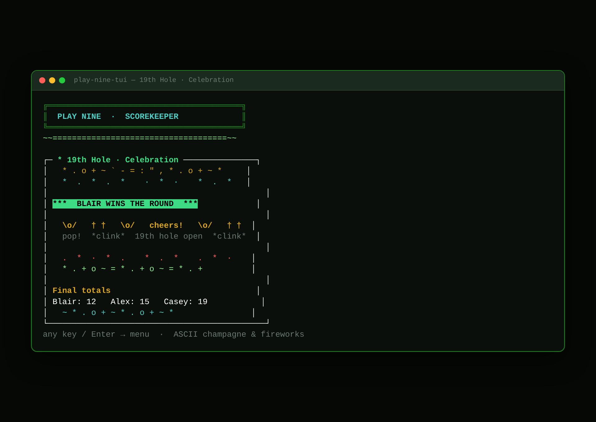

# Play Nine Scorekeeper TUI

Rust + [ratatui](https://ratatui.rs/) **terminal scorekeeper** for the card game *Play Nine* — not a card-play engine. Pick 9 or 18 holes, enter player names, type an integer score per hole, watch running totals (lowest wins), finish with an ASCII champagne/fireworks celebration, and keep summarized history in JSON.

**Stack:** Rust · ratatui · crossterm · serde_json · MIT

> GitHub Pages can serve the `/docs` folder for a dark-theme UI preview: [docs/index.html](docs/index.html).

## Screenshots

| Menu | Scoring | Celebration |
|------|---------|-------------|
|  |  |  |

## Requirements

- Rust toolchain (`rustc` / `cargo`) — edition 2021, MSRV 1.85
- A terminal that speaks ANSI color (most SSH clients do)

## Build & run

```bash
git clone https://github.com/oldandcodey/play-nine-tui.git
cd play-nine-tui
cargo run
# or:
cargo build --release
./play
# equivalent:
./target/release/play-nine-tui
```

Working directory matters: JSON is written to **`data/play_nine.json`** relative to the process CWD. Run from the project root (or create `./data` where you launch the binary). The `./play` script always `cd`s to the project root first.

## SSH / Tailscale tips

```bash
# Ensure a usable TERM before launch (common over SSH):
export TERM=xterm-256color
# Optional: force color if your multiplexor strips it
export COLORTERM=truecolor

ssh you@host 'cd /path/to/play-nine-tui && ./play'
```

- Needs a real TTY (interactive SSH session). Piping into the binary will fail.
- If colors look wrong, try `TERM=xterm-256color` or `screen-256color`.
- Resize the terminal if the scorecard feels cramped (especially 18 holes).

## How to play (scorekeeper flow)

1. **New game** → choose **9** or **18** holes  
2. Enter player names (Enter after each; empty Enter starts; max 8)  
3. For each hole / player, type an **integer** score and Enter  
4. Running totals update on the scorecard (lowest total wins; leaders marked with `▲`)  
5. After the last hole: **celebration** — big winner banner, champagne toast frames, denser confetti rain, ASCII fireworks (animated via `celebration_tick`)  
6. Relaunch → **History** shows finished rounds from JSON; unfinished rounds appear as **Resume**  
7. On the scoring screen, press **`e`** to jump/edit a prior hole+player score

Keys (also shown in the footer):

| Screen     | Keys                                      |
|------------|-------------------------------------------|
| Menu       | ↑/↓, Enter, `N` New, `R` Resume, `H` History, `Q`/`q` Quit |
| Holes      | ←/→ or Tab, Enter, Esc                    |
| Players    | type, Enter, Backspace (removes last), Esc|
| Scoring    | digits / `-`, Enter, `e` jump/edit hole+player, Esc (save & menu) |
| Celebrate  | any key → menu (animated ASCII party)     |
| History    | ↑/↓, Esc                                  |

## UX extras (v1.1+)

- **Funny golf sayings** (~25): one PG one-liner in the scoring status bar. Re-rolls when the hole number changes (not on every keypress).
- **Fairway accent** under the banner; while scoring, a small **ASCII golf vignette** (flag / tee / cart / bunker) rotates with each new hole.
- **Celebration**: multi-line toast + fireworks + confetti rain; terminal-friendly ASCII / common symbols only (SSH-safe fixed widths).

## Data & errors

| Path | Contents |
|------|----------|
| `data/play_nine.json` | `current_game` (if mid-round) + `history[]` summaries |
| `data/` | Created at runtime if missing (also gitignored for `*.json`) |

**Bad input:** non-integer scores, empty names, duplicates, and out-of-range scores (−20…40) show an on-screen error and are not applied.

**Corrupt JSON:** on startup the app prints a clear message and exits. Rename or delete `data/play_nine.json` (e.g. to `play_nine.json.bak`) and restart — a fresh store is created on the next save.

## Not in scope

- Dealing / flipping / card logic  
- Network multiplayer  
- Truecolor unicode emoji fireworks (kept ASCII / common symbols for SSH width safety)

## Contributing

See [CONTRIBUTING.md](CONTRIBUTING.md).

## License

MIT — Copyright (c) 2026 Bob Pelletier. See [LICENSE](LICENSE).
